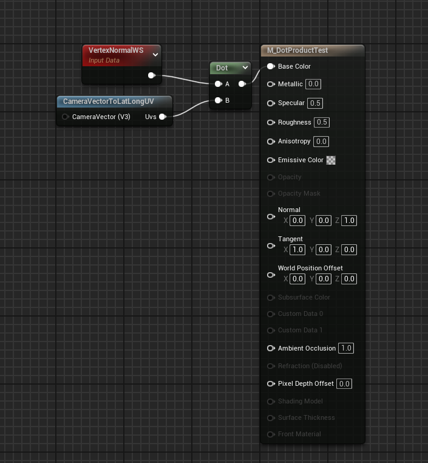
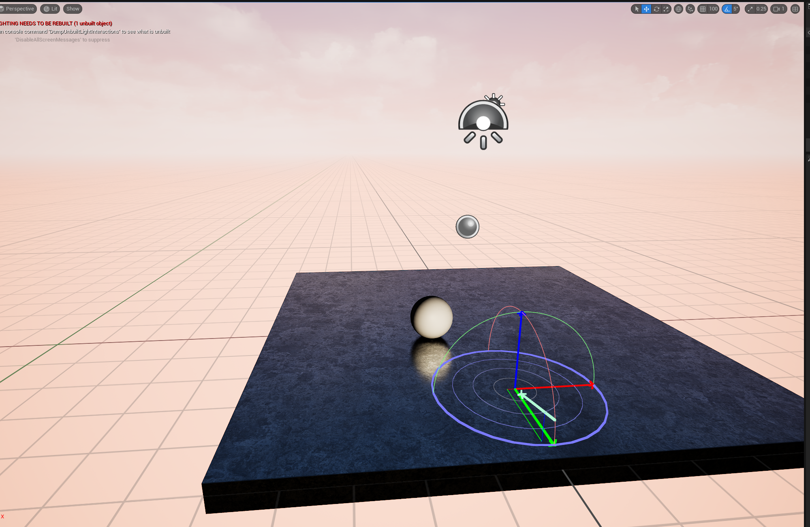
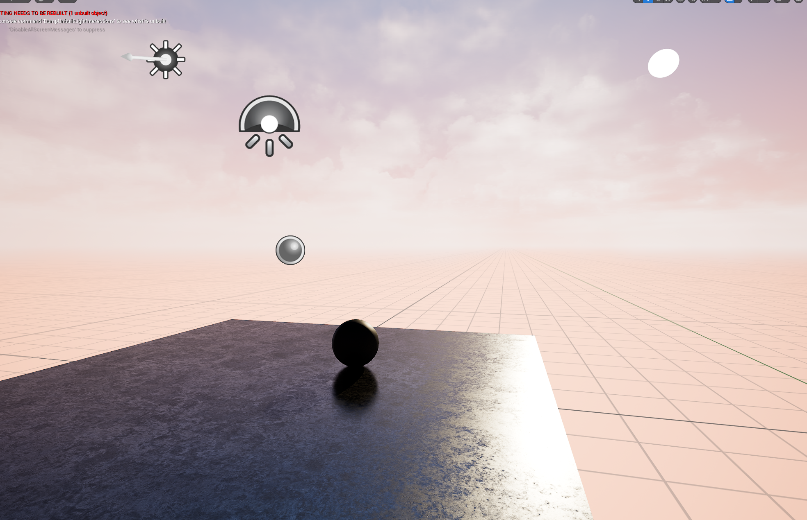

# Daily Log — 2026-05-22

**Phase:** 1 — Foundation
**Week:** 01
**Focus:** Vector Math for Technical Artists — Dot Product Theory & Practice

---

## ✅ Completed Today

| # | Task | Status |
|---|------|--------|
| 1 | YouTube — Freya Holmér · *"Why can't you multiply vectors?"* | ✅ Done |
| 2 | YouTube — Freya Holmér · *"The Dot Product"* | ✅ Done |
| 3 | UE5 Material Editor — Built Dot Product node graph (Fresnel-like effect) | ✅ Done |

---

## 📚 Learnings

### Video 1 — *"Why can't you multiply vectors?"* (Freya Holmér)

#### 1. The Math Behind Shaders and Graphics Computation

Component-wise vector multiplication (Hadamard product) is a practical shortcut commonly used in shader code — not a formal algebraic operation. Geometric Algebra reveals the deeper structure: the dot product (scalar result) and the wedge product / cross product (bivector result) are unified under a single canonical multiplication operation. Understanding this distinction gives a TA far greater control over shader authoring, debugging, and creative problem-solving.

#### 2. Bivectors and Planes — A Richer Way to Think About Space

- **Rotation happens in a plane, not around an axis.** The conventional axis-based (XYZ) rotation model is a simplified view. Geometric Algebra shows that every rotation is fundamentally a 2D planar operation.
- **Bivectors as oriented area.** A bivector captures the signed projected area between two vectors on a given plane — a concept that directly aids visualization of 3D transformations inside a game engine.

#### 3. Curvature and Splines — An Elegant Generalization

Wikipedia's curvature formula differs between 2D (signed scalar) and 3D (cross product magnitude), making it brittle and hard to generalize. Using the wedge product, the curvature calculation becomes dimensionally consistent — preserving directional sign and working uniformly across 2D, 3D, and higher dimensions. A direct practical benefit for anyone building or debugging spline tools.

#### 4. Quaternions and Rotors — Where the "Magic" Comes From

Quaternions are not arbitrary. They emerge naturally when multiplying two vectors using the full Geometric Algebra product. Freya's spline library case study demonstrates a concrete payoff: reversing spline orientation — normally requiring matrix or quaternion multiplication — reduces to a component swizzle, which is computationally free. This is the kind of math-informed optimization that separates a strong TA from a copy-paste shader artist.

#### 5. Problem-Solving Mindset

A skilled TA does not blindly consume shader code from the internet. Knowing the underlying math provides full agency to modify visual behavior, diagnose graphical artifacts at their root, and invent new rendering techniques — rather than waiting for someone else to publish a solution.

---

### Video 2 — *"The Dot Product"* (Freya Holmér)

#### Formula

```
A · B = Ax*Bx + Ay*By + Az*Bz
      = |A| * |B| * cos(θ)
```

When both vectors are **normalized** (length = 1):

```
A · B = cos(θ)
```

This directly returns the cosine of the angle between them — no extra computation required.

#### Output Reference Table

| Angle Between Vectors | Dot Product Result |
|-----------------------|--------------------|
| 0° — same direction   | 1                  |
| 90° — perpendicular   | 0                  |
| 180° — opposite       | −1                 |

#### Practical Analogy

Imagine standing in sunlight. Facing directly toward the sun → maximum light received (value = 1). Facing directly away → no light (value = −1). Facing sideways at 90° → value = 0. The dot product measures exactly this: **how aligned two directions are.**

#### Primary Shader Applications

- **Diffuse lighting** — Lambert shading model
- **Fresnel / rim light** — edge glow effects
- **Facing direction detection** — determining whether a surface faces a given target

---

## 🔧 UE5 Practice — Material Editor

### Goal

Build a material whose color changes based on the angle between the surface normal and the camera direction — a manual Fresnel-like effect — using only the Dot Product node.

### Node Graph

```
[Vertex Normal WS] ──┐
                     ├──→ [Dot Product] ──→ [Base Color]
[Camera Vector]  ────┘
```

### Steps

1. Open Material Editor in UE5
2. Add node: `Vertex Normal WS`
3. Add node: `Camera Vector`
4. Connect both outputs to a `Dot Product` node
5. Connect `Dot Product` output → `Base Color`
6. Apply material to a mesh (Sphere or Plane)
7. Observe how color intensity shifts as viewing angle changes

### Result

**Node material dot product**


**Front view — surface facing camera**


**Back view — surface facing away from camera**


**Top view — surface perpendicular to camera**


---

## 💡 Key Takeaways

- The dot product is **not** ordinary multiplication — it produces a scalar, not a vector
- With normalized vectors, the dot product directly equals `cos(θ)` — a powerful and cheap computation
- The dot product is foundational to lighting (Lambert diffuse), Fresnel, rim lighting, and facing detection in shaders
- UE5 Material Editor exposes this as a native `Dot Product` node — ready to use immediately
- Understanding **why** the formula works (via Geometric Algebra) enables deeper shader authorship, not just pattern-matching

---

## 🗓️ Plan for Tomorrow — 2026-05-23

| Priority | Task |
|----------|------|
| 1 | YouTube — Freya Holmér · *"The Cross Product"* |
| 2 | Continue vector math study relevant to Technical Art |

---

*Path: `progress/week-01/daily/2026-05-22.md`*
