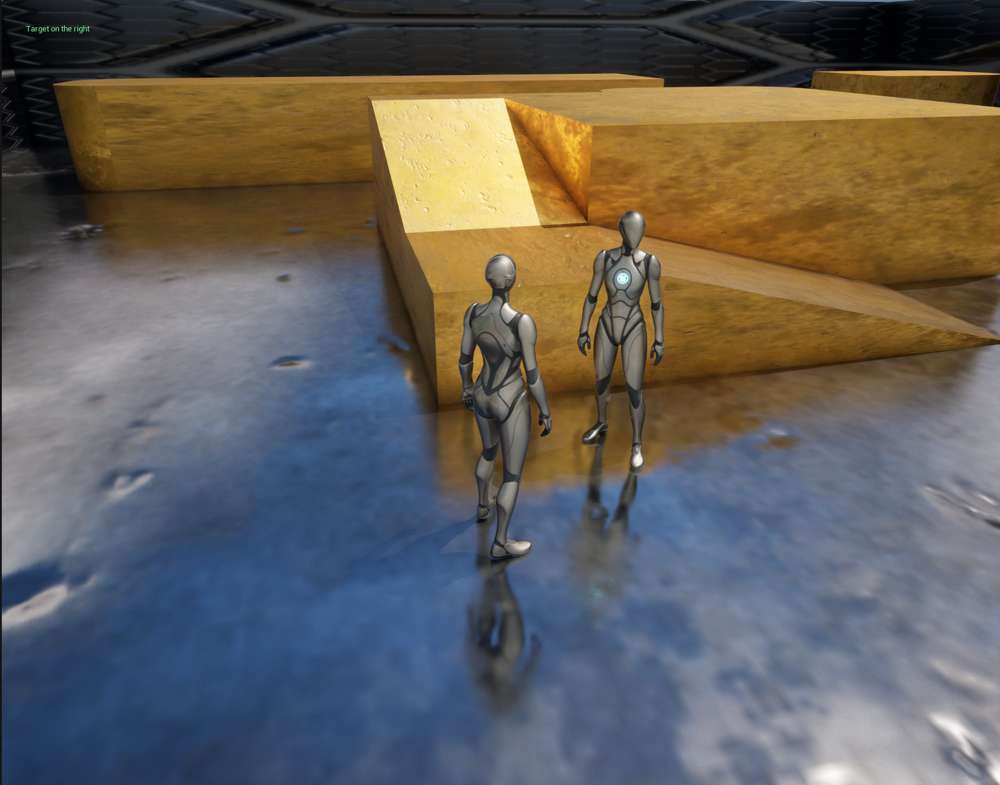
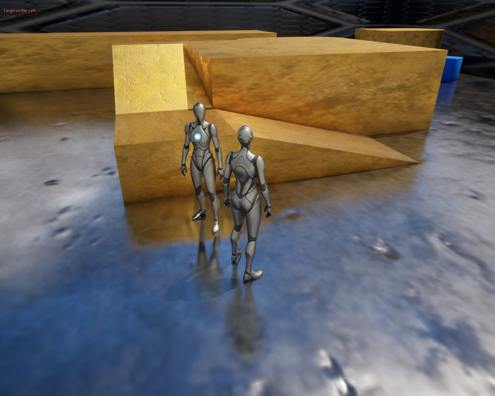
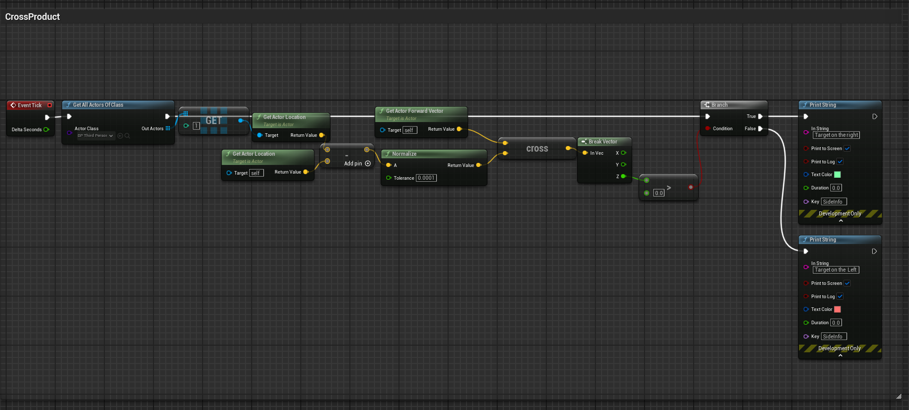

# Daily Log — 2026-05-24

**Phase:** 1 — Foundation
**Week:** 01
**Focus:** Vector Math for Technical Artists — Cross Product Applied in Blueprint

---

## ✅ Completed Today

| # | Task | Status |
|---|------|--------|
| 1 | Implement Cross Product direction detection — UE5 Blueprint | ✅ Done |
| 2 | Publish to ArtStation — Vector Math series, Post 2 | ✅ Done |

---

## 🔧 Implementation — Cross Product Direction Detection (Blueprint)

### What Was Built

A Blueprint that detects whether a target actor is to the **left** or **right** of the player in real time — using Cross Product, without any trigonometry.

### Node Graph — Step by Step

| Step | Node | Purpose |
|------|------|---------|
| 1 | **Get All Actors Of Class** (`BP_ThirdPerson`) | Retrieves the target actor from the scene |
| 2 | **Subtract** (Vector) | Computes direction vector: `Target Position − Self Position` |
| 3 | **Normalize** | Converts direction vector to unit length |
| 4 | **Cross Product** | `Normalized Direction × Self Forward Vector` |
| 5 | **Break Vector** | Decomposes result into X, Y, Z components |
| 6 | **Z-value evaluation** | `Z > 0` → Right · `Z < 0` → Left |

**Output:** Real-time debug text displayed on screen, updating as the target moves relative to the player.

---

### Result

** view 1 — right**

** view 2 — left**

**Node material dot product**

---

---

## 📌 Published

Post published on **ArtStation** as part of the ongoing vector mathematics in game development series.

> **Series context:** Yesterday (2026-05-23) covered the theory — formula derivation, the nail analogy, the Z-compass concept. Today bridges theory to practice: the same Z-sign logic implemented live in UE5 Blueprint and verified in-viewport.

---

## 💡 Key Insight

> Cross product eliminates the need for `atan2()` or `acos()` when all you need is directionality. Reading the sign of the Z component gives you left/right instantly — cheaper, cleaner, and more readable in a Blueprint graph.

**Broader TA relevance:**
- This exact pattern (normalized direction × forward → Z sign) is portable to HLSL as `cross()` — usable directly inside a Material Function for orientation-based masking
- AI behavior, camera rigs, and shader-level side detection all use the same underlying operation

---

## ❓ Open Questions

- **What happens when `Self` and `Target` are at the exact same position?** → The Subtract result is a zero vector. Normalizing a zero vector in UE5 returns `(0, 0, 0)` by default — the cross product then returns zero and the Z-check fails silently. This edge case needs a guard node (`Is Nearly Zero` → branch) before the Normalize step.

---

## 🗓️ Plan for Tomorrow — 2026-05-25

| Priority | Task | Resource |
|----------|------|----------|
| 1 | Shader / material fundamentals | YouTube — Ben Cloward channel |
| 2 | AI-assisted node learning | For every unfamiliar node: query Claude with full specific context — not vague questions. Include: node name, what it connects to, what you expected vs. what happened. |

---

## References

- [Freya Holmér — The Cross Product (YouTube)](https://www.youtube.com/watch?v=eu6i7WJeinw) — theory foundation from 2026-05-23
- [Unreal Engine Docs — Blueprint Cross Product](https://dev.epicgames.com/documentation/en-us/unreal-engine/BlueprintAPI/Math/Vector/CrossProduct)
- [Unreal Engine Docs — Get All Actors Of Class](https://dev.epicgames.com/documentation/en-us/unreal-engine/BlueprintAPI/Utilities/GetAllActorsOfClass)

---

*Path: `progress/week-01/daily/2026-05-24.md`*
