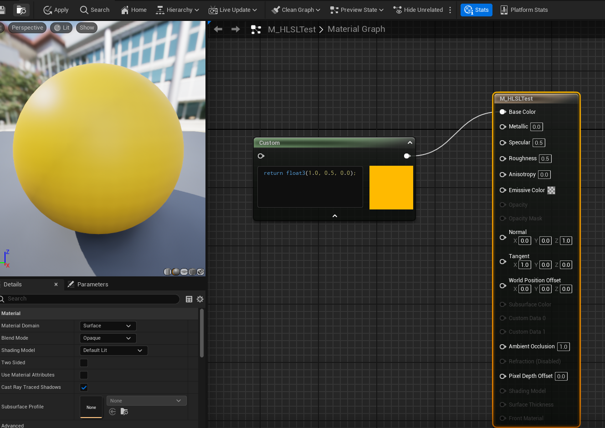
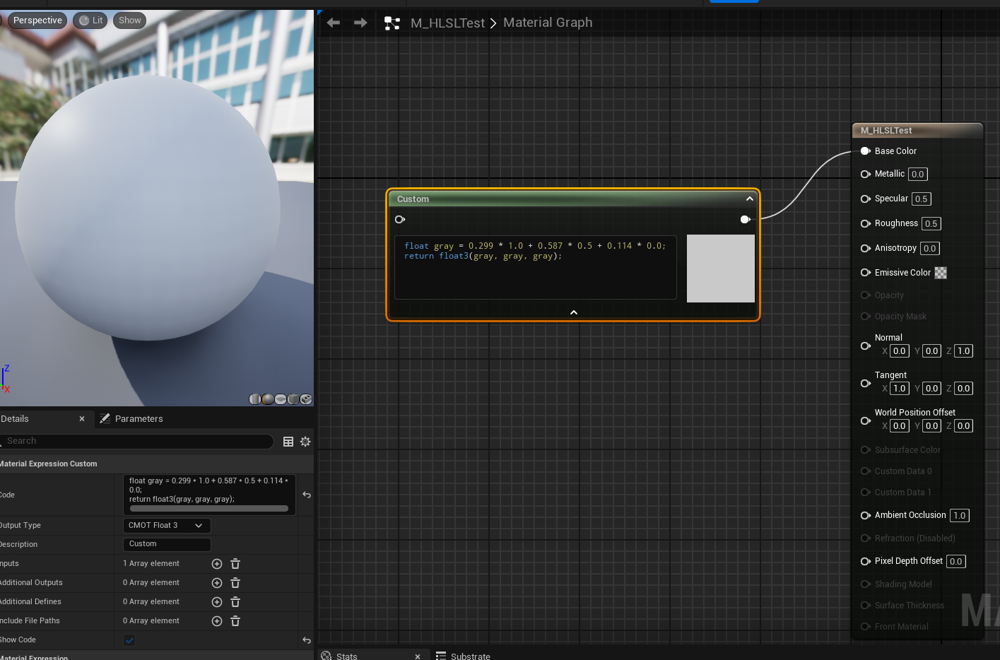

# Daily Log — 2026-05-27

**Phase:** 1 — Foundation &nbsp;**Week:** 2 &nbsp;**Tools:** Unreal Engine 5 — Material Editor, HLSL Custom Node &nbsp;**Status:** ✅ Completed

---

## Today's Objective

Write the first HLSL expression inside Unreal Engine's Material Editor and understand the fundamentals of color data types in shader code.

---

## What I Worked On

### Block 1 — First HLSL Expression in the Material Editor

- Created a new Material `M_HLSLTest` in the Content Browser
- Spawned a **Custom Node** inside the Material Graph
- Wrote the first HLSL expression:

```hlsl
return float3(1.0, 0.5, 0.0);
```

- Set **Output Type → CMOT Float 3**
- Connected the Custom node's output pin to **Base Color**
- Applied and saved — sphere rendered orange 🟠

### Result

**Node and material color**


---

### Block 2 — Color Modification Experiments

Successfully changed the sphere's color by modifying the `float3` values:

| Code | Color |
|------|-------|
| `float3(1.0, 0.0, 0.0)` | Red |
| `float3(0.0, 1.0, 0.0)` | Green |
| `float3(0.0, 0.0, 1.0)` | Blue |
| `float3(1.0, 1.0, 0.0)` | Yellow |
| `float3(0.0, 0.0, 0.0)` | Black |
| `float3(1.0, 1.0, 1.0)` | White |

---

### Block 3 — Concepts & Deep Dives

#### Error Encountered & Resolved

```
error: expected ';' after return statement
return float3 (1.0, 0.5, 0.0)
```

**Root cause:** A space between `float3` and `(`, and a missing semicolon at the end of the statement.

**Fix:**

```hlsl
// ❌ Incorrect
return float3 (1.0, 0.5, 0.0)

// ✅ Correct
return float3(1.0, 0.5, 0.0);
```

---

## Key Concepts Learned

### 1. Why the Custom Node Exists

The Custom Node is the entry point for writing raw HLSL directly inside the Material Editor. It is used when a required visual effect cannot be achieved with Unreal's built-in nodes alone.

---

### 2. Anatomy of `return float3(1.0, 0.5, 0.0);`

| Part | Meaning |
|------|---------|
| `return` | "Send this value out of the node" |
| `float3(...)` | A container for 3 values (R, G, B) |
| `1.0, 0.5, 0.0` | Red = 100%, Green = 50%, Blue = 0% |
| `;` | End of statement (mandatory in HLSL) |

---

### 3. The 0.0 – 1.0 Scale vs. 0 – 255

The GPU operates on **percentages**, not absolute values:

```
0.0  →  0    (  0%)
0.5  →  128  ( 50%)
1.0  →  255  (100%)
```

**Example:** Orange in Photoshop at `RGB(255, 128, 0)` is written as `float3(1.0, 0.5, 0.0)` in shader code.

---

### 4. float, float2, float3, float4

| Type | Channels | Typical Use |
|------|----------|-------------|
| `float` | 1 value | Roughness, Opacity, Timer |
| `float2` | 2 values (U, V) | UV texture coordinates |
| `float3` | 3 values (R, G, B / X, Y, Z) | RGB color, 3D position |
| `float4` | 4 values (R, G, B, A) | Color with Alpha channel |

Per-channel access syntax:

```hlsl
float4 color = float4(1.0, 0.5, 0.0, 1.0);
color.r  // Red
color.g  // Green
color.b  // Blue
color.a  // Alpha
```

---

### 5. Exercise 1 — Manual Grayscale Conversion

```hlsl
float gray = 0.299 * 1.0 + 0.587 * 0.5 + 0.114 * 0.0;
return float3(gray, gray, gray);
```

**Logic:** The human eye is not equally sensitive to all color channels. The weights reflect perceptual sensitivity:

- Green `0.587` — highest sensitivity
- Red `0.299` — mid sensitivity
- Blue `0.114` — lowest sensitivity
- Sum of weights = `1.0` ✅

This is the **Luminance Formula** — the industry standard for converting color to grayscale.

### Result

**Node and material color**

---

## Key Takeaways

- HLSL in a shader is the language the GPU uses to determine the color of every pixel on screen
- `float3(R, G, B)` is the foundation of all color representation in shader code
- Every visual effect has its own underlying math — the goal is not to memorize formulas, but to understand the reasoning behind them, then look up the specifics when needed
- **TA mindset:** observe an effect → identify the math it requires → find the formula → implement and verify

---

## Tomorrow's Plan — 2026-05-28

- [ ] **HLSL Exercise 2** — implement the next exercise building on today's float3 and color fundamentals
- [ ] **The Book of Shaders** — begin working through [thebookofshaders.com](https://thebookofshaders.com) to build a stronger mathematical foundation for procedural shader work

---

*Phase 1 — Foundation · Week 2 · Engine: UE 5.4 · Hardware: RTX 5060 Ti 16GB*
