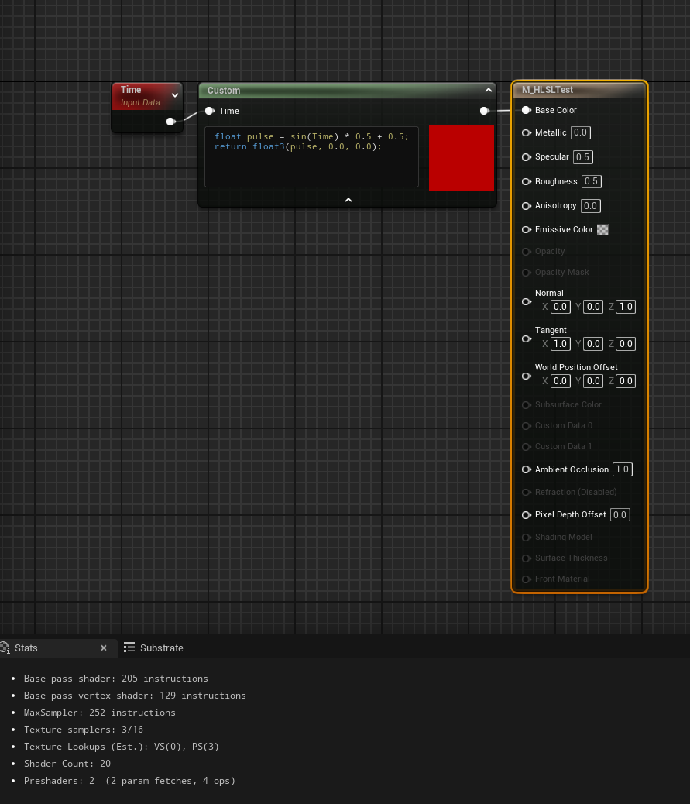
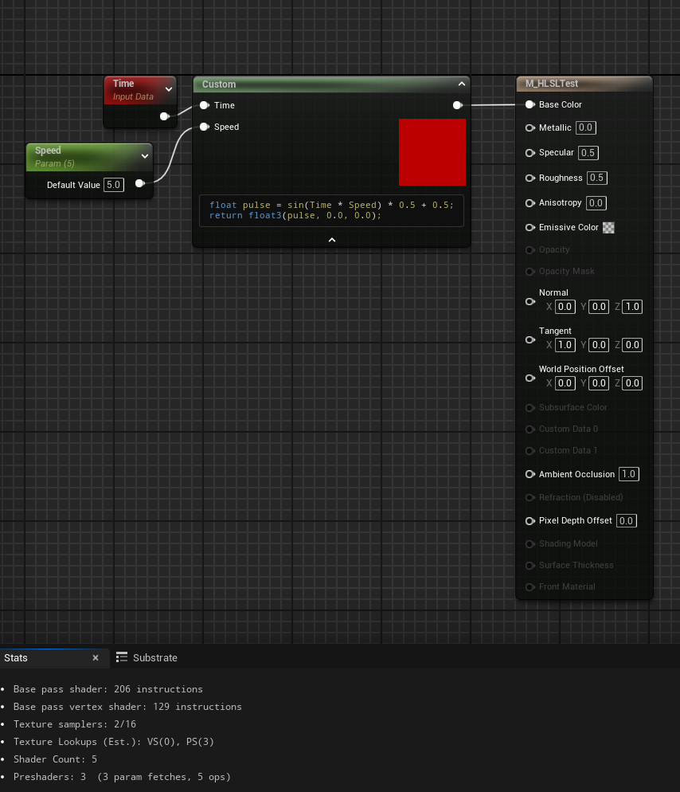
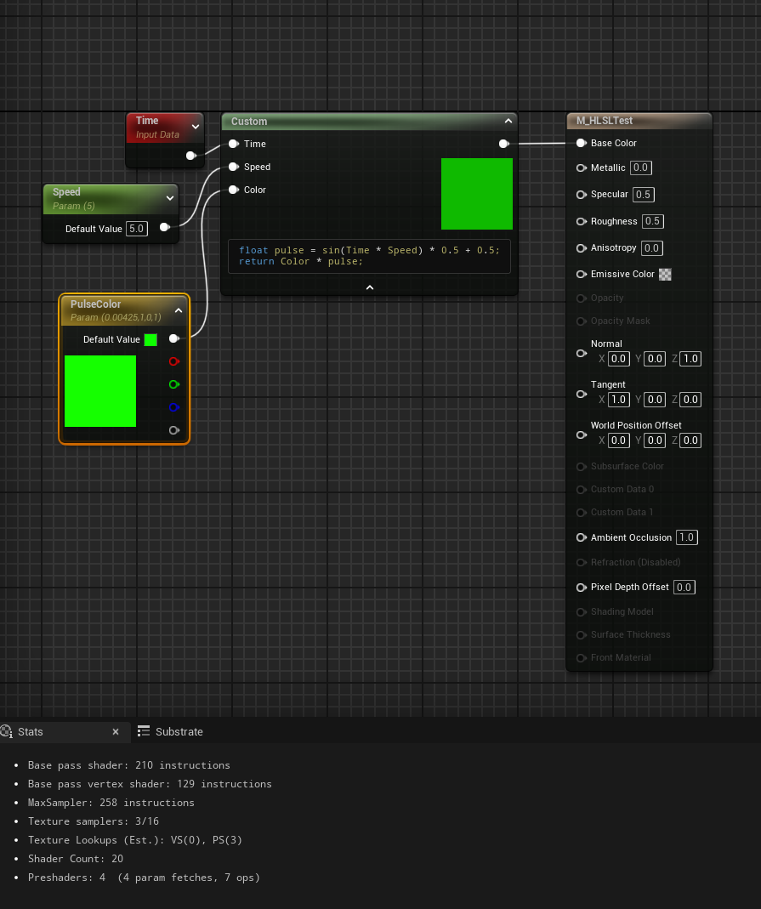
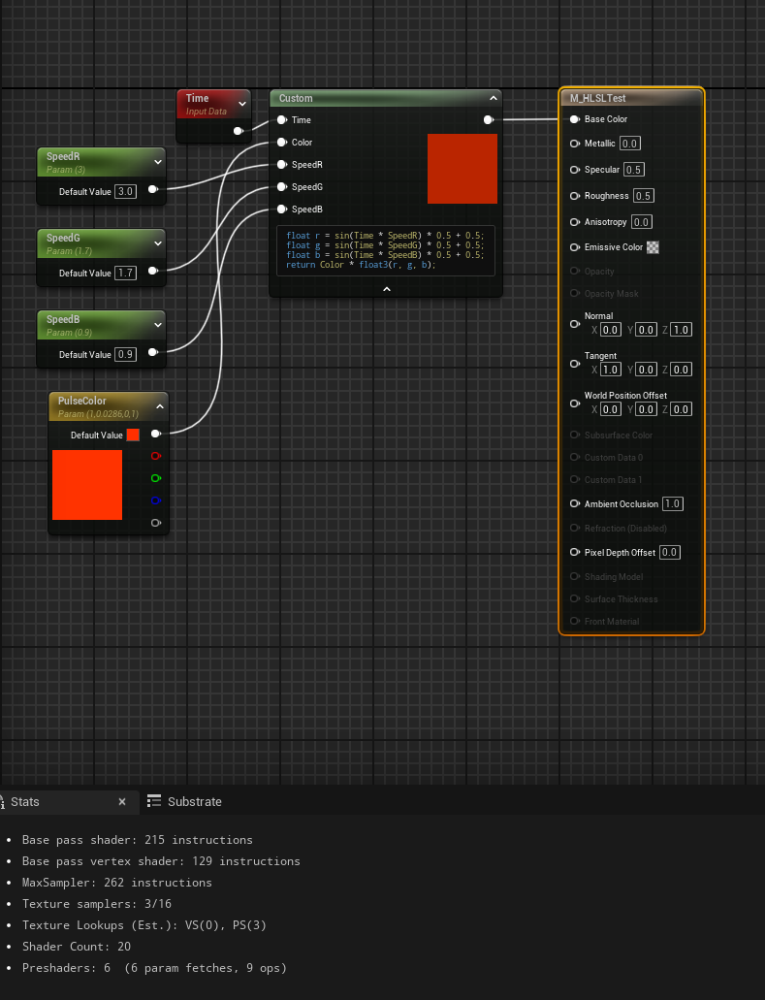
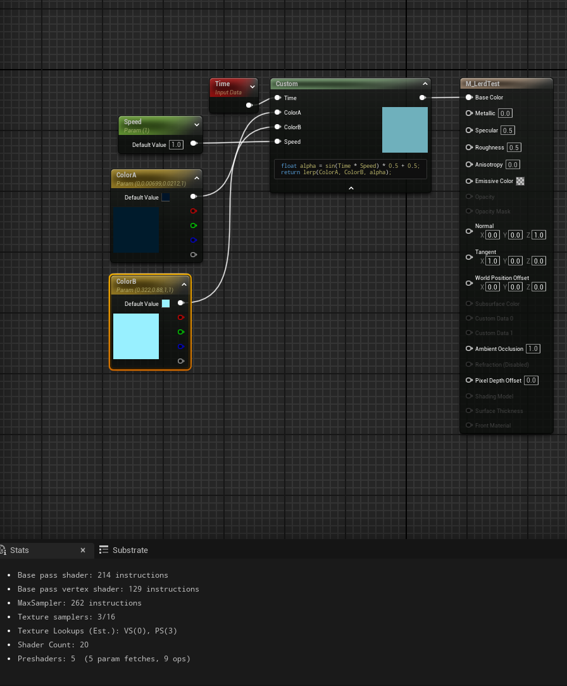
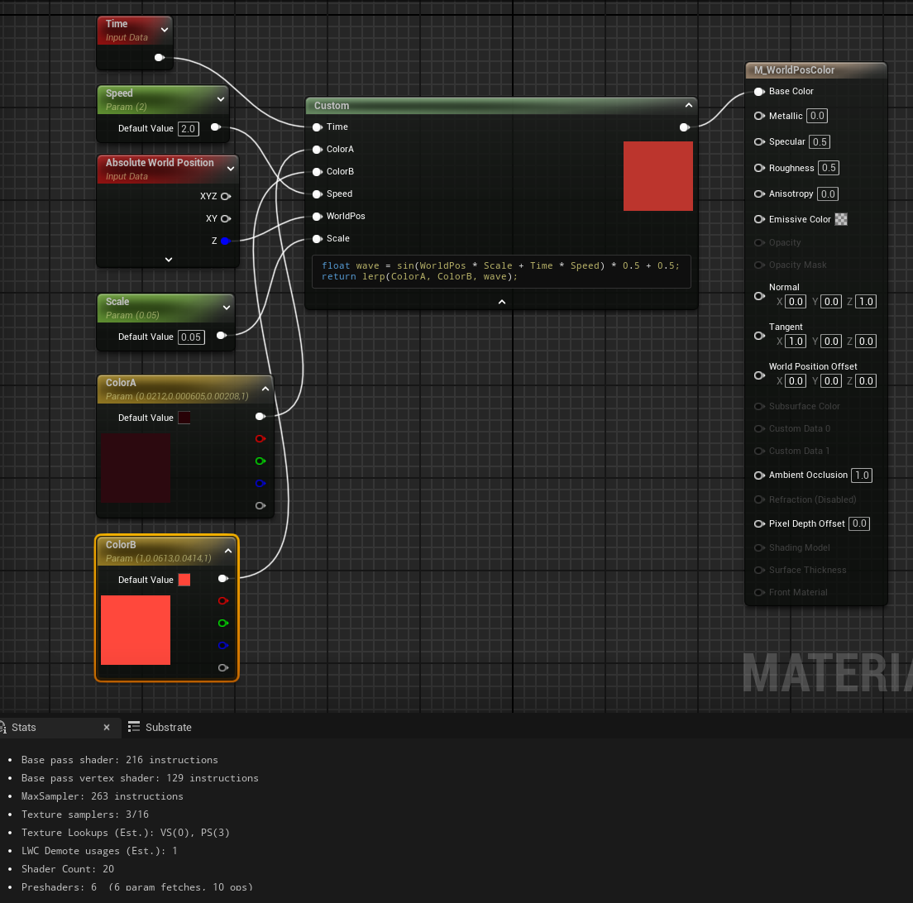
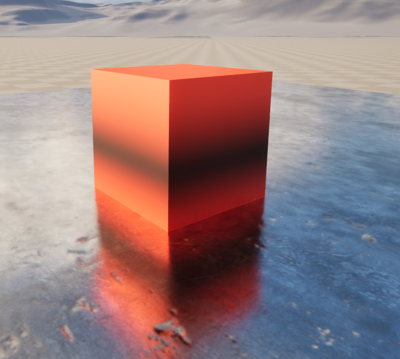

# Daily Log — 2026-05-28

**Phase:** 1 — Foundation &nbsp;**Week:** 2 &nbsp;**Tools:** Unreal Engine 5 — Material Editor, HLSL Custom Node &nbsp;**Status:** ✅ Completed

---

## Today's Objective

Continue HLSL Exercise 2 — build a time-based pulsing color shader and progressively extend it through five sub-exercises: speed control, color parameterization, multi-channel independent rhythm, lerp-based color blending, and world-position-driven wave patterns.

---

## What I Worked On

### Exercise 2A — Time-Based Pulsing Color (Base)

Implemented the core pulsing pattern using a sine wave driven by the built-in `Time` node.

**Code:**
```hlsl
float pulse = sin(Time) * 0.5 + 0.5;
return float3(pulse, 0.0, 0.0);
```

**How it works:**
- `sin(Time)` produces a continuous oscillation — a value that rises and falls every frame
- `* 0.5 + 0.5` remaps the range from `−1..1` to `0..1`, because color channels cannot be negative
- `float3(pulse, 0, 0)` animates only the Red channel; Green and Blue remain at zero

**Result:**
**Node material**



---

### Exercise 2B — Speed Control via Scalar Parameter

Replaced the hardcoded `sin(Time)` with `sin(Time * Speed)`, exposing pulse speed as an artist-facing parameter.

**Changes made:**
1. Added a new input `Speed` to the Custom node via the Details panel
2. Added a `ScalarParameter` node — Parameter Name: `Speed`, Default Value: `1.0`
3. Connected `Speed` param → `Speed` pin on the Custom node

**Updated code:**
```hlsl
float pulse = sin(Time * Speed) * 0.5 + 0.5;
return float3(pulse, 0.0, 0.0);
```

**Key insight:** Multiplying `Speed` into a `sin()` call is one of the cheapest operations the GPU can perform — changing the value from `1.0` to `100.0` adds zero meaningful overhead. What actually affects shader performance is instruction count, texture sample count, and how many pixels the material covers on screen.

**Result:**
**Node material**


---

### Exercise 2C — Color Control via Vector Parameter

Replaced the hardcoded `float3(pulse, 0, 0)` with a `VectorParameter`, decoupling pulse intensity from color choice. Artists can now change the color from the Details panel without touching any code.

**Changes made:**
1. Added a new input `Color` to the Custom node
2. Added a `VectorParameter` node — Parameter Name: `PulseColor`, default set to a chosen color
3. Connected `PulseColor` param → `Color` pin

**Updated code:**
```hlsl
float pulse = sin(Time * Speed) * 0.5 + 0.5;
return Color * pulse;
```

**Logic:** `Color` controls which hue is displayed; `pulse` controls its brightness at any given moment. When `pulse = 0` the surface goes black; when `pulse = 1` the full color is displayed. The two concerns are independent.

**Result:**
**Node material**


---

### Exercise 2D — Multi-Channel Independent Rhythm

Extended the shader so each RGB channel oscillates at its own frequency, producing a continuously color-shifting effect rather than a flat brightness pulse.

**Changes made:**
1. Replaced the single `Speed` input with three inputs: `SpeedR`, `SpeedG`, `SpeedB`
2. Added three `ScalarParameter` nodes with intentionally non-integer default values:
   - `SpeedR` → `3.0`
   - `SpeedG` → `1.7`
   - `SpeedB` → `0.9`
3. Connected each param to its respective Custom node input

**Updated code:**
```hlsl
float r = sin(Time * SpeedR) * 0.5 + 0.5;
float g = sin(Time * SpeedG) * 0.5 + 0.5;
float b = sin(Time * SpeedB) * 0.5 + 0.5;
return Color * float3(r, g, b);
```

**Key insight:** The specific numbers `3.0`, `1.7`, `0.9` are not special — what matters is that the ratios between channels are not whole numbers. Integer ratios (`1.0, 2.0, 3.0`) produce patterns that repeat quickly and feel mechanical. Non-integer ratios produce patterns that almost never repeat, which reads as organic. In practice, values are always tuned visually — set initial values, play in viewport, adjust until it feels right.

**Result:**
**Node material**

---

### Exercise 2E — Lerp Between Two Colors

Replaced the multiply-based dimming (`Color * pulse`) with a lerp, enabling smooth transitions between two full colors without ever passing through black.

**Changes made:**
1. Replaced `Color` input with two inputs: `ColorA` and `ColorB`; restored single `Speed` input
2. Added two `VectorParameter` nodes — `ColorA` (dark/base color) and `ColorB` (bright/accent color)
3. Connected both params to their respective inputs

**Updated code:**
```hlsl
float alpha = sin(Time * Speed) * 0.5 + 0.5;
return lerp(ColorA, ColorB, alpha);
```

**Lerp formula recap:**
```
lerp(A, B, alpha) = A + (B - A) * alpha
alpha = 0  →  result is ColorA
alpha = 1  →  result is ColorB
alpha = 0.5  →  midpoint between both
```

**Critical difference from previous exercises:** All prior exercises dipped to black when `pulse = 0` because the color was multiplied by zero. Lerp never touches black — it travels directly between two chosen colors. This produces transitions that look substantially more professional and is the standard approach in shipped game effects.

**Professional color pairs by context:**

| Context | ColorA | ColorB |
|---|---|---|
| Sci-fi UI / HUD | `#001428` (deep blue) | `#00e5ff` (bright cyan) |
| Danger / Low HP | `#1a0000` | `#ff3c00` |
| Alien / Bioluminescent | `#002200` | `#aaff00` |
| Magic | `#1a0033` | `#cc44ff` |
| Ice / Cryo | `#001433` | `#aaddff` |
| Fire / Lava | `#3d0000` | `#ffcc00` |

**General rule:** ColorA is a very dark tint of the hue (not pure black — the surface should still read as volumetric at minimum brightness). ColorB is a high-saturation, high-brightness version of the same hue.

**Result:**
**Node material**

---

---

### Exercise 2F — World Position-Driven Wave

Extended the lerp shader with a World Position input so each pixel computes its own wave phase based on where it sits in world space, creating a flowing pattern across the object surface rather than a flat uniform pulse.

**Changes made:**
1. Added `WorldPos` and `Scale` inputs to the Custom node alongside existing `Time`, `Speed`, `ColorA`, `ColorB`
2. Added a `WorldPosition` node to the graph → connected its Z component (via `ComponentMask`) to the `WorldPos` pin
3. Added `ScalarParameter`: `Scale` → default `0.05`

**Updated code:**
```hlsl
float wave = sin(WorldPos * Scale + Time * Speed) * 0.5 + 0.5;
return lerp(ColorA, ColorB, wave);
```

**How it works:**
- `WorldPos * Scale` — each pixel's vertical position in world space, compressed to a workable range
- `+ Time * Speed` — adds movement so the pattern flows rather than staying static
- Result: a sine wave that travels vertically across the object surface

**Wire connections:**
| Source | Target |
|---|---|
| `Time` node | `Time` pin |
| `WorldPosition` → `ComponentMask (.Z)` | `WorldPos` pin |
| `ScalarParameter (Scale)` | `Scale` pin |
| `ScalarParameter (Speed)` | `Speed` pin |
| `VectorParameter (ColorA)` | `ColorA` pin |
| `VectorParameter (ColorB)` | `ColorB` pin |
| Custom output | `Base Color` |

**Important note for Unreal:** World Position values in UE5 can reach thousands of units depending on object placement in the scene. `Scale = 0.05` is a safe starting point, but it often needs to be reduced further if the wave pattern appears too dense. This is expected behavior, not a bug.

**Result:**
**Node material**


**Viewport**


---

## Key Concepts Learned

### 1. The Fundamental Pulse Pattern

```hlsl
sin(Time) * 0.5 + 0.5
```

This single pattern is the foundation of nearly all animated shader effects. Every exercise today is a variation or extension of it:

| Effect | Application |
|---|---|
| Emissive pulse | `sin(Time) * 0.5 + 0.5` on Emissive Intensity |
| Glow on UI | Combined with lerp and screen-space position |
| Hologram vibration | Multiple sin waves at slight offsets |
| Radar sweep | sin + world position + rotation |
| Waypoint blink | sin driving Opacity |

### 2. Parameter Hygiene

Hardcoding values in shader code should be avoided wherever an artist or designer might reasonably want to adjust the value during production. The progression through today's exercises reflects this principle:

- `Speed` — `ScalarParameter`, so animators can key it in Sequencer
- `PulseColor` / `ColorA` / `ColorB` — `VectorParameter`, accessible in the Details panel and from Blueprint
- `Scale` — `ScalarParameter`, because optimal value depends on object size and placement

### 3. Multiply vs. Lerp

| Approach | Behavior at minimum | Use case |
|---|---|---|
| `Color * pulse` | Goes to black | Emissive glow building from dark |
| `lerp(A, B, pulse)` | Shows ColorA | Smooth color transitions, never unlit-looking |

### 4. Per-Pixel Variation via World Position

The conceptual leap in Exercise 2F is that `WorldPos` breaks the assumption that all pixels share the same animated value. Once a world-space or object-space coordinate is introduced into the shader, every pixel on the surface becomes unique — the enabling condition for scan lines, dissolve effects, lava flows, and procedural surface patterns.

---

## Tomorrow's Plan — 2026-05-29

- [ ] **The Book of Shaders** — read and work through Chapters 1–3 on [thebookofshaders.com](https://thebookofshaders.com)
- [ ] **Ben Cloward** — watch and study Episodes 4–5 of the Unreal Engine material series

---

*Phase 1 — Foundation · Week 2 · Engine: UE 5.4 · Hardware: RTX 5060 Ti 16GB*
