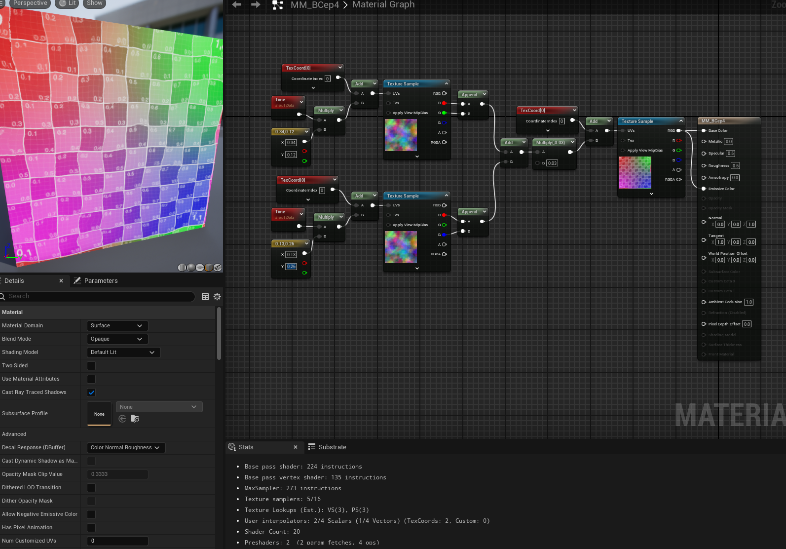

# Daily Log — 2026-05-29

**Phase:** 1 — Foundation **Week:** 2 **Tools:** Unreal Engine 5 — Material Editor, HLSL Custom Node, The Book of Shaders **Status:** ✅ Completed

---

## Today's Objective

Study The Book of Shaders (Chapters 1–3) to build a solid theoretical foundation in GPU programming, then continue Ben Cloward's Unreal Engine material series with Episode 4 (UV distortion via noise textures).

---

## What I Studied

### The Book of Shaders — Chapter 1: A Paradigm Shift

**Core concept: how shader execution differs from conventional code**

Conventional CPU programming is sequential — the computer executes one instruction at a time: draw a circle, then a square, then a line. Shader programming on the GPU inverts this model entirely. The code you write runs simultaneously across every pixel on screen. The GPU acts like an automated printing press: it receives the pixel's coordinate as input and immediately outputs its color.

**Why shaders are fast — parallel processing**

A modern display running at 1080p60 must process roughly 124 million pixels per second. Assigning that workload to a CPU — which has only a handful of processing threads working sequentially — would cause an immediate bottleneck. GPUs solve this by trading a small number of powerful pipelines for thousands of small ones running in parallel. Additionally, GPUs contain dedicated hardware circuits that accelerate the mathematical operations shaders depend on most: trigonometry, matrix multiplication, and vector arithmetic.

**GLSL — the language used in the book**

The Book of Shaders uses GLSL (OpenGL Shading Language), the cross-platform shader language standardized by the Khronos Group. The key translation for Unreal Engine work: GLSL maps conceptually to HLSL (High-Level Shading Language), which is what Unreal Engine's Custom nodes use.

**The two fundamental constraints of GPU programming**

Understanding these two constraints explains most of the design decisions made when writing shaders:

| Constraint | Description | Practical consequence |
|---|---|---|
| **Blind** | Each thread runs in isolation — a pixel at the left edge of the screen has no knowledge of what the pixel at the right edge is doing | No shared state between pixels; all logic must be computed from inputs alone |
| **Memoryless** | A thread is flushed immediately after it finishes — it retains no memory of the previous frame | Animated effects must be derived from stateless inputs such as `Time`, not from stored history |

**Key takeaway:** Writing a shader means writing one universal mathematical formula. That formula is deployed across millions of pixels simultaneously to determine each pixel's color in a single instant.

---

### The Book of Shaders — Chapter 2: Hello World

**"Hello World" in shader terms is a solid color**

Because rendering text on the GPU is non-trivial for beginners, the equivalent of "Hello World" in shader programming is filling the entire screen with one flat color. This is the minimum useful program.

**Anatomy of a minimal GLSL shader**

```glsl
#ifdef GL_ES
precision mediump float;
#endif

void main() {
    gl_FragColor = vec4(1.0, 0.0, 0.0, 1.0);
}
```

The key elements:

- `void main()` — every GLSL shader requires exactly one entry point, identical in concept to C
- `gl_FragColor` — the built-in output variable; assigning a value here determines the pixel's final color
- `vec4(r, g, b, a)` — a 4-dimensional vector holding the Red, Green, Blue, and Alpha channels

**Normalized color values: 0.0 to 1.0**

Unlike design applications that use 0–255, shaders normalize all color values to the range `0.0` to `1.0`. `vec4(1.0, 0.0, 0.0, 1.0)` means full red, no green, no blue, fully opaque.

**Float precision discipline**

The GPU strictly distinguishes between integers and floats. Writing `1` instead of `1.0` in a context that expects a float causes a compile error. This is non-negotiable: always write `1.0`, `0.0`, never `1` or `0` when a float is expected. The precision qualifier (`lowp`, `mediump`, `highp`) trades rendering quality for performance — lower precision runs faster but can introduce visual artifacts.

**GLSL → HLSL translation table**

| Concept | GLSL (The Book of Shaders) | HLSL (Unreal Engine Custom Node) |
|---|---|---|
| 4D vector | `vec4(r, g, b, a)` | `float4(r, g, b, a)` |
| 3D vector | `vec3(x, y, z)` | `float3(x, y, z)` |
| 2D vector | `vec2(x, y)` | `float2(x, y)` |
| Linear interpolation | `mix(a, b, t)` | `lerp(a, b, t)` |
| 4×4 matrix | `mat4` | `float4x4` |

**Entry point structure difference**

In standard GLSL, the full function body must be written out and the result assigned to the global `gl_FragColor`. In Unreal Engine's Custom Node, the engine has already generated the surrounding function — the Custom Node is a slot within it. Therefore `void main()` must never be written; instead, return the value directly:

```hlsl
// Unreal Engine Custom Node
return float4(1.0, 0.0, 0.0, 1.0);
```

The `OutputType` in the Custom Node's Details panel must also be set to `CMOT Float 4` to match the return type.

---

### The Book of Shaders — Chapter 3: Uniforms

**What a Uniform is**

Because GPU threads are isolated from each other and from the CPU, there must be a mechanism for passing external data — time, screen size, mouse position — to every pixel simultaneously. This mechanism is the Uniform variable. It is called "uniform" because every thread receives the same value, and it is read-only; the GPU cannot modify it.

**Unreal Engine equivalent:** Uniforms map directly to Material Parameters (`ScalarParameter`, `VectorParameter`).

**The three standard uniforms introduced in the chapter**

| Uniform | Contains | Unreal Engine equivalent |
|---|---|---|
| `u_time` | Elapsed time in seconds since shader start | `Time` node |
| `u_resolution` | Canvas width and height in pixels | `ViewSize` node |
| `u_mouse` | Mouse cursor position within the canvas | (varies by setup) |

**`gl_FragCoord` — per-pixel position input**

Unlike uniforms (which are identical for every pixel), `gl_FragCoord` is a built-in variable that holds the X/Y screen-space coordinate unique to each pixel. It is the GPU's way of telling each thread where on the screen it is located.

**Coordinate normalization — the most important technique in this chapter**

Raw screen coordinates from `gl_FragCoord` range from `(0, 0)` to `(screenWidth, screenHeight)` — unusably large for color math. The standard technique to normalize them:

```glsl
vec2 st = gl_FragCoord.xy / u_resolution;
```

Dividing position by total canvas size maps all coordinates to the range `0.0–1.0`, where `(0.0, 0.0)` is the bottom-left corner and `(1.0, 1.0)` is the top-right. In Unreal Engine, this normalized coordinate space is already provided by the `TextureCoordinate` (UV) node — no manual normalization required.

**Connecting theory to prior exercises**

| Chapter 3 concept | Applied in this repo |
|---|---|
| `u_time` as a sine input (`sin(u_time)`) | Exercise 2A: `float pulse = sin(Time) * 0.5 + 0.5;` — the `* 0.5 + 0.5` remap converts sin's `−1..1` range to the GPU-compatible `0..1` range |
| Uniforms as artist-facing parameters | Exercises 2B & 2C: `ScalarParameter (Speed)` and `VectorParameter (PulseColor)` are custom uniforms injected by the material graph |
| Non-integer ratios for pseudo-randomness | Exercise 2D: frequencies `3.0`, `1.7`, `0.9` per channel — ratios that avoid integer relationships produce patterns that feel organic rather than mechanical |
| `gl_FragCoord` — per-pixel spatial variation | Exercise 2F: `WorldPosition.Z` serves the same role in 3D — breaking the assumption that all pixels share a uniform value, enabling flowing wave patterns across a surface |

---

### Ben Cloward — Episode 4: UV Distortion with Noise Textures

**1. Textures as data, not images**

A critical mental model shift for Technical Artists: a texture is not just a picture — it is a 2D array of numbers. Black = `0`, White = `1`, grey tones are values between. Those values can be used as offsets to shift the UV coordinates of a second texture, creating a distortion effect. This reframing — *texture as data* — underlies most advanced material work.

**Channel packing**

Storing different noise data in the R, G, and B channels of a single texture file is a standard TA optimization technique. Three independent data sets are delivered in one texture sample, reducing memory usage and texture fetch count.

**2. Core vector math operations in the material graph**

| Operation | Node | Effect on UVs |
|---|---|---|
| Addition | `Add` | Offsets / scrolls texture position |
| Multiplication | `Multiply` | Scales texture or controls effect intensity |

Multiplying a noise value by a small constant (e.g. `0.03`) is the standard way to control distortion strength without changing the underlying texture.

**3. Solving the tiling problem**

A single scrolling texture inevitably shows visible repetition (tiling artifacts) that breaks immersion. The TA solution: sample the same noise texture twice, scroll each copy in a different diagonal direction and at a different speed. When the two distorted UV sets are combined, the resulting pattern appears non-repeating to the human eye — organic and random-looking — without any additional performance cost beyond one extra texture sample.

**4. Versatility of the UV distortion pattern**

The same mathematical logic — use a noise texture to offset UV coordinates — produces entirely different effects depending on context:

- Water ripples / caustics
- Fire and smoke
- Heat haze / vision impairment
- Sci-fi energy shield
- Magical portal distortion

One pattern of nodes; many shipped effects. This is the core value of building a reusable shader vocabulary.

**Result:**
**Node material**

---

## Key Concepts Learned

### 1. GPU Execution Model

Every pixel runs the same code simultaneously. The shader is a mathematical function, not a sequence of drawing commands. Accepting this paradigm shift is the prerequisite for everything else in shader development.

### 2. GLSL / HLSL Parity

The Book of Shaders uses GLSL; Unreal Engine uses HLSL. The concepts are identical — the syntax differences are superficial. The translation table above covers the most common cases.

### 3. Uniforms = Material Parameters

The formal category "Uniform" from graphics theory maps directly to what Unreal Engine calls a Material Parameter. Understanding this equivalence makes the book's examples immediately applicable to production UE5 work.

### 4. Normalization Is Everything

Shader math requires all values to live in the range `0.0–1.0`. Coordinate normalization (`position / resolution`), sine remapping (`* 0.5 + 0.5`), and value clamping are all expressions of the same need: keep numbers in a range the GPU can interpret as color.

### 5. Textures as Numerical Data

Shifting perception of a texture from "image" to "data array" unlocks the entire domain of data-driven material effects — distortion, masking, procedural animation, channel-packed utility maps.

---

## Tomorrow's Plan — 2026-05-30

- [ ] **Ben Cloward** — Episode 5, Unreal Engine material series
- [ ] **ArtStation** — post some result

---

*Phase 1 — Foundation · Week 2 · Engine: UE 5.4 · Hardware: RTX 5060 Ti 16GB*
