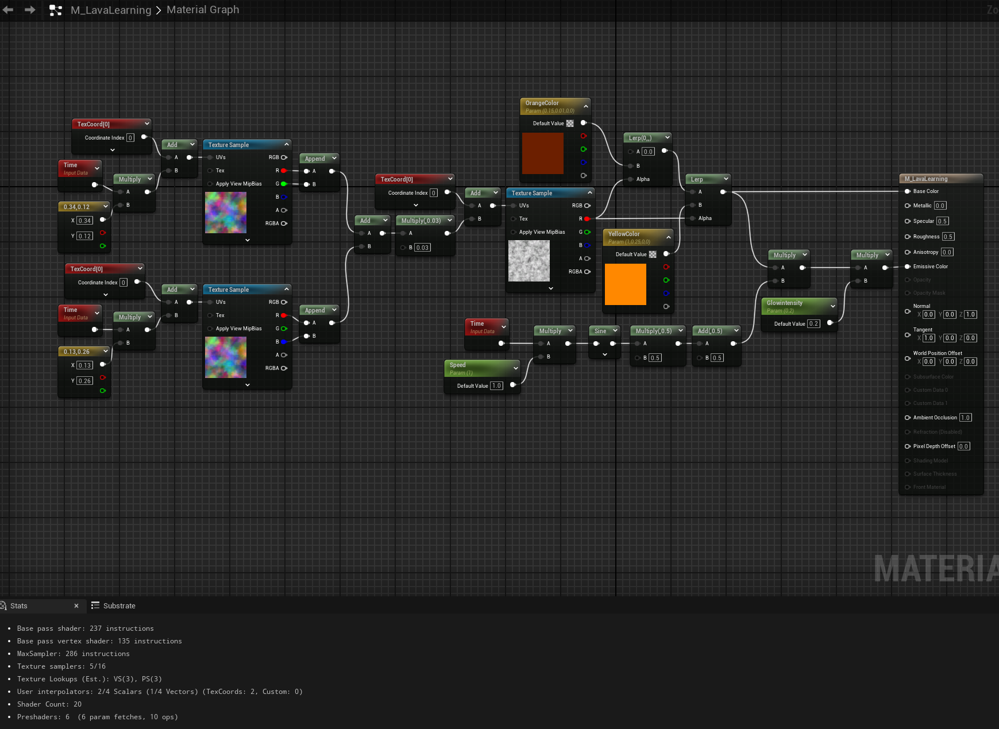
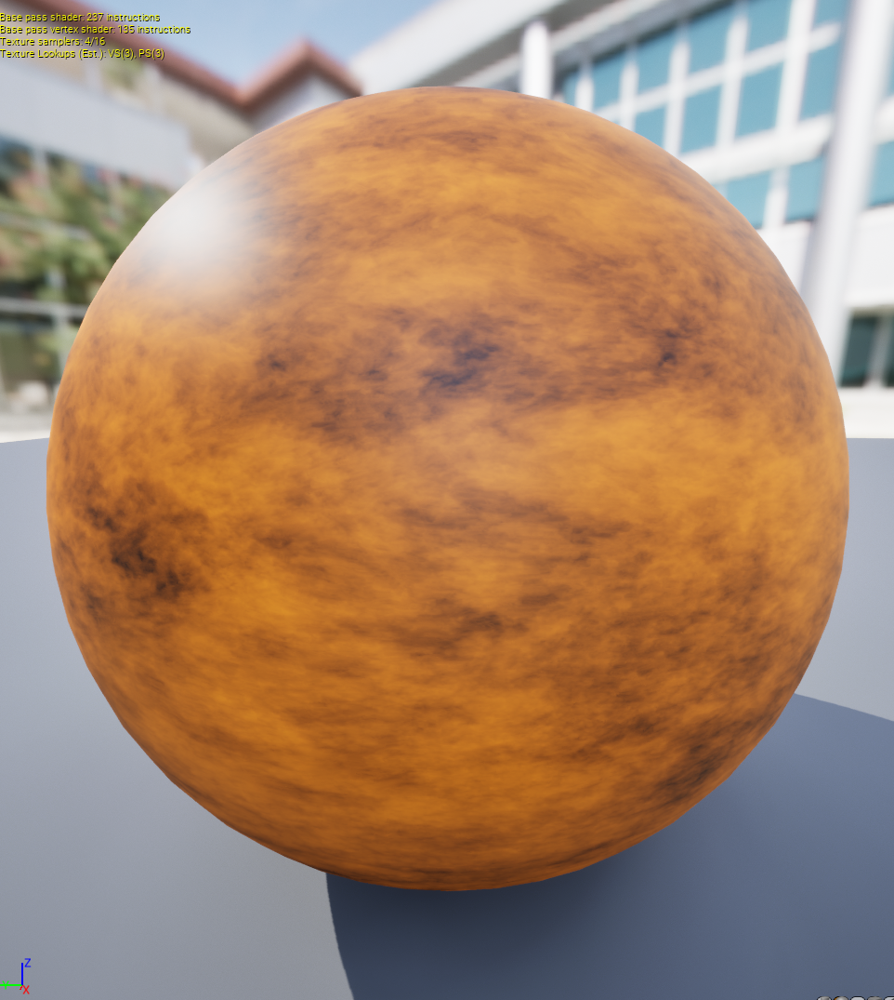
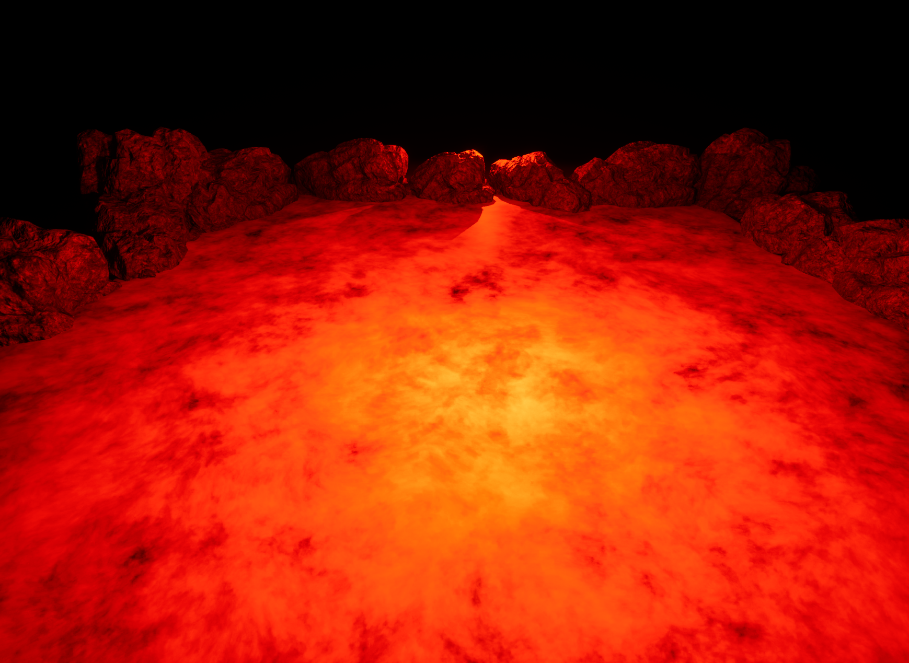

# Daily Log — 2026-05-31

**Phase:** 1 — Foundation · **Week:** 2 · **Tools:** Unreal Engine 5 — Material Editor · **Status:** ✅ Completed

---

## Today's Objective

Design and build the first fully independent material — no tutorial followed, concepts applied from scratch. The result had to be posted to ArtStation as a public deliverable.

Decision made on 2026-05-29: build a **lava material** using the UV distortion system from Ben Cloward Ep. 4 as the foundation, then layer original decisions on top.

---

## What I Built

### Blood Lava — Procedural Lava Material

> *"What if lava looked like it was bleeding from the earth?"*

That question was the only brief. Every node decision followed from it.

---

### Node Architecture

#### 1. UV Distortion Layer (foundation from Ep. 4)

Two noise textures scroll in opposite diagonal directions at different speeds:

| Layer   | Scroll Direction | Speed Constants |
| ------- | ---------------- | --------------- |
| Noise 1 | +X, +Y           | 0.34, 0.12      |
| Noise 2 | −X, −Y           | 0.13, 0.26      |

Each noise passes through `Add → Multiply(0.03) → Add` to offset the base `TexCoord[0]`. The opposing directions cancel visible tiling and produce an organic, non-repeating distortion pattern — the same principle that underlies fire, water ripple, and energy shield effects.

**Key insight reinforced:** The noise textures are not images. They are 2D arrays of floating-point values used as UV offset data. This is the mental model shift that makes advanced material work possible.

---

#### 2. Lava Mask (original decision)

A third `Texture Sample` receives the **distorted UVs** as input rather than raw `TexCoord`. This means the mask itself is being warped by the distortion system — the pattern moves and flows rather than sitting still underneath it.

The **R channel** output is used as the mask value (0.0 = cooled crust, 1.0 = molten core).

---

#### 3. Three-Color Lerp Blend (original decision)

Two chained `LinearInterpolate` nodes blend across three artist-defined colors using the lava mask as Alpha:

```
Lerp A:  Black (0, 0, 0)          → OrangeColor   | Alpha = Noise 3 R
Lerp B:  Output of Lerp A         → YellowColor    | Alpha = Noise 3 R
```

| Parameter    | Value          | Role                          |
| ------------ | -------------- | ----------------------------- |
| `OrangeColor`| 0.4, 0.02, 0.0 | Deep red — cooling crust      |
| `YellowColor`| 1.0, 0.3, 0.0  | Burning orange — molten core  |

The same noise R pin feeds both Lerp Alpha inputs. One texture sample, two blend decisions.

---

#### 4. Emissive Pulse (original decision)

```
Time → Multiply(Speed) → Sine → Multiply(0.5) → Add(0.5) → Multiply(LerpB output) → Multiply(GlowIntensity) → Emissive Color
```

The `× 0.5 + 0.5` remap converts sine's `−1..1` output into the `0..1` range the GPU requires for color values — the same normalization principle from *The Book of Shaders* Chapter 3 (`u_time` sine remapping, studied 2026-05-29).

The pulse modulates the lerp output, not a flat color — so the glow breathes with the lava's own pattern rather than uniformly brightening the whole surface.

---

#### 5. Exposed Parameters

| Parameter           | Type          | Default | Purpose                              |
| ------------------- | ------------- | ------- | ------------------------------------ |
| `Speed`             | ScalarParam   | 1.0     | Controls pulse frequency             |
| `DistortionStrength`| ScalarParam   | 0.03    | Controls UV offset intensity         |
| `GlowIntensity`     | ScalarParam   | 0.2     | Controls emissive brightness         |
| `OrangeColor`       | VectorParam   | —       | Dark crust color (artist-adjustable) |
| `YellowColor`       | VectorParam   | —       | Hot core color (artist-adjustable)   |

---

### Scene Setup for Portfolio Shot

To communicate the material in context rather than on an isolated sphere, a scene was built around it:

- Large `Plane` mesh (scale 10×10) as the lava surface
- Multiple `SM_Rock` meshes arranged along the far edge for scale and framing
- Two `Point Lights` with color `R:255, G:40, B:0` providing lava bounce light on the rocks
- Scalability set to **Cinematic**, Bloom active via Post Processing
- Camera positioned at approximately 10–15 degrees above horizontal — classic volcanic field angle

Final render captured with **F9** (high-resolution screenshot, saved to `Saved/Screenshots/`).

---

## Key Concepts Applied Today

### 1. Independent design vs. tutorial following

Following a tutorial exercises memory and observation. Designing independently exercises judgment. Today was the first time every node choice had to be justified by a creative or technical reason, not by "Ben put it here."

### 2. The same math, different context

`sin(Time) × 0.5 + 0.5` was first encountered as a color pulse in Ep. 4 exercises. Today it drove emissive breathing on a custom material. The node is identical — the *intent* is original.

### 3. Textures as masks, not images

The lava mask noise was never visible as a texture. It existed entirely as floating-point data feeding an Alpha pin. This is the practical application of the paradigm shift documented on 2026-05-29.

### 4. Lighting as part of the material presentation

A technically correct material on a grey sphere in default lighting communicates nothing. Placing it in a scene with intentional lighting — rim light on rocks, bounce from below — is part of the TA's job when presenting work.

---

## Result

**Result:**
**Node material**


**Material lava**


**Material lava**



**Blood Lava** — posted to ArtStation.

> *Week 2 is where the theory became something you can stand next to and feel the heat from.*

- [ArtStation post](#) ← *(add link after publishing)*
- [Node graph screenshot](#) ← *(add to `/progress/week-02/screenshots/`)*

---

## Tomorrow's Plan — 2026-06-01

- [ ] **Recap** — review and consolidate everything learned across Week 1–2: GPU model, GLSL/HLSL parity, UV distortion, lerp blending, emissive animation, flipbook UV math
- [ ] **Study** — William Faucher: *"Lumen in UE5: Everything You Need to Know"* (YouTube)


---

*Phase 1 — Foundation · Week 2 · Engine: UE 5.4 · Hardware: RTX 5060 Ti 16GB*
